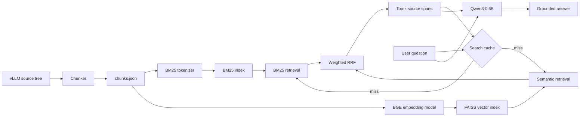

*This project has been created as part of the 42 curriculum by rumontei.*

# RAG Against the Machine

## Description

RAG Against the Machine is a local Retrieval-Augmented Generation (RAG)
system that answers questions about the vLLM 0.10.1 source tree. It indexes
Python source code and documentation, retrieves the most relevant source
spans for a natural-language question, and gives those spans to a small local
language model to produce a grounded answer.

The project provides both a command-line interface and an HTTP API. It can
process one question interactively or run retrieval and answer generation over
the public evaluation datasets. All indexes, embeddings, source metadata, and
cached search results are stored locally under `data/processed`.

The main technologies are:

- `bm25s` for lexical retrieval;
- `BAAI/bge-small-en-v1.5` for CPU-compatible semantic embeddings;
- FAISS for exact vector search;
- weighted Reciprocal Rank Fusion (RRF) for hybrid ranking;
- `Qwen/Qwen3-0.6B` for local answer generation;
- FastAPI for the local HTTP interface.

## Features

- File-type-aware chunking for Python, Markdown, reStructuredText, and text
  files.
- Source attribution through file paths and exact character offsets.
- English tokenization, stop-word removal, and stemming for BM25.
- Semantic retrieval over normalized embeddings.
- Hybrid lexical and semantic ranking.
- Persistent BM25, FAISS, embedding, and query-result caches.
- Single-query and dataset-oriented commands.
- Local answer generation with a context-grounded prompt.
- Local HTTP endpoints for health checks, search, and question answering.

## System Architecture



The main modules and their responsibilities are:

| Module | Responsibility |
| --- | --- |
| `src/cli.py` | Exposes the CLI commands through Python Fire. |
| `src/chunking.py` | Discovers supported files and creates source-aware chunks. |
| `src/embeddings.py` | Provides the BM25 tokenizer and semantic embedding model. |
| `src/storage.py` | Loads and saves chunks and embedding data. |
| `src/retrieval.py` | Runs BM25 and FAISS retrieval, then fuses both rankings. |
| `src/generation.py` | Builds the grounded prompt and generates an answer with Qwen. |
| `src/service.py` | Coordinates indexing, search, caching, and answer generation. |
| `src/schemas.py` | Defines the Pydantic input and output structures. |
| `src/api.py` | Exposes the RAG service through FastAPI. |

During indexing, the chunker reads the repository and records each chunk with
its source path and character interval. The chunk text feeds both the BM25 and
embedding pipelines. During search, the question is sent to both retrievers;
their ranked lists are fused and returned as source locations. During answer
generation, the matching chunk text is added to the prompt sent to Qwen.

## Chunking Strategy

The default maximum chunk size is 2,000 characters and can be changed through
`--max_chunk_size`.

### Documentation and text files

Files ending in `.md`, `.rst`, or `.txt` are split with a sliding character
window. With the default size:

- window size: 2,000 characters;
- stride: 900 characters (`45%` of the window size);
- overlap: 1,100 characters (`55%` of the window size).

The large overlap helps preserve information that crosses a chunk boundary,
which improves the probability that a complete supporting passage appears in
at least one result. The trade-off is a larger index and more near-duplicate
candidates.

### Python files

Python source is parsed with the standard-library `ast` module. Every regular
or asynchronous function is treated as a logical unit, including methods and
nested functions. A method is prefixed with its enclosing class names so that
the indexed text retains class context.

- Functions up to the maximum size remain intact.
- Larger functions are divided into consecutive blocks of at most the maximum
  size.
- AST byte offsets are converted to character offsets so that Unicode source
  still produces correct locations.
- Each chunk stores its type, source path, file hash, first character index,
  and last character index.

AST-based segmentation keeps related code together and produces precise source
attribution. Its main trade-off is that module-level statements and classes
without functions are not indexed as independent Python chunks. This is one
reason code retrieval is more difficult than documentation retrieval.

## Retrieval Method

### Lexical retrieval

The lexical branch uses `bm25s`. Both corpus text and queries pass through the
same tokenizer, which removes English stop words and applies English stemming
with PyStemmer. BM25 is effective for exact technical terms such as class
names, functions, flags, and error messages.

### Semantic retrieval

The semantic branch uses `BAAI/bge-small-en-v1.5` through
Sentence Transformers. The model runs on CPU, has a configured maximum
sequence length of 450 tokens, and returns normalized embeddings. The vectors
are stored in a FAISS `IndexFlatIP` index. Because the vectors are normalized,
inner-product ranking is equivalent to cosine-similarity ranking.

`IndexFlatIP` performs exact search instead of approximate nearest-neighbour
search. This preserves retrieval quality for the current index size, at the
cost of linear work as the corpus grows.

### Hybrid ranking

For a requested result count `k`, each branch retrieves:

```text
candidate_k = min(max(k * 4, 20), number_of_chunks)
```

The two rankings are combined with weighted Reciprocal Rank Fusion. For a
one-based rank `r`, each candidate receives:

```text
score = 2 / (60 + r)    for a BM25 occurrence
      + 1 / (60 + r)    for a semantic occurrence
```

The final results are sorted by this combined score and truncated to `k`.
RRF avoids comparing raw BM25 and cosine scores, whose scales are unrelated.
The 2:1 lexical weight favours exact identifiers while still rewarding
semantic agreement. Retrieving more candidates than the final `k` gives both
branches enough depth to contribute useful results.

## Answer Generation

The answer stage loads `Qwen/Qwen3-0.6B`. Retrieved source locations are mapped
back to their chunks, and up to the first 600 characters of each chunk are
included in the prompt. The prompt instructs the model to:

- use the supplied context as its main information source;
- avoid unsupported facts;
- state when the context is insufficient;
- answer directly and concisely.

Qwen's thinking mode is disabled and generation is limited to 150 new tokens.
This keeps local CPU inference and output length manageable, but it also limits
the amount of context and detail available for complex questions.

## Performance Analysis

The current processed index contains 1,971 source files and 22,239 chunks. Its
artifacts occupy approximately 114 MB, including a 7 MB BM25 index, a 52 MB
embedding archive, and a 34 MB FAISS index.

Recall was measured on the two public datasets, each containing 100 questions.
A relevant source is counted as retrieved when the file path matches and the
retrieved character interval overlaps at least 5% of the reference interval.
The table uses the first `k` results from the hybrid ranking built with
2,000-character chunks.

| Dataset | Recall@1 | Recall@3 | Recall@5 | Recall@10 |
| --- | ---: | ---: | ---: | ---: |
| Documentation | 58% | 79% | 88% | 91% |
| Code | 41% | 47% | 57% | 61% |

The documentation results benefit from overlapping windows and repeated domain
terms. Code questions are harder because symbols can be referenced indirectly
and the AST strategy focuses on functions and methods. Increasing `k` improves
both datasets, but also sends more context to the generator and increases the
chance of retrieving redundant chunks.

CPU-only timings were measured on a Darwin ARM64 machine with Python 3.14.4,
`OMP_NUM_THREADS=1`, and `VECLIB_MAXIMUM_THREADS=1`. Models and indexes were
already present locally, so download time is excluded.

| Operation | Measured time |
| --- | ---: |
| Load the embedding model and retrieval indexes | 0.29 s |
| Hybrid retrieval for 100 documentation questions | 2.20 s (22.0 ms/query) |
| Hybrid retrieval for 100 code questions | 2.42 s (24.2 ms/query) |
| Read 100 documentation results from the query cache | 0.066 s (0.66 ms/query) |

These numbers are indicative rather than universal: CPU model support, thread
configuration, storage speed, cache state, and chunk count all affect runtime.
Index construction is more expensive than retrieval because every chunk must
be tokenized and embedded, but its artifacts are persisted for later runs.

To reproduce the official retrieval evaluation on the campus Linux machine:

```bash
./moulinette evaluate_student_search_results \
  data/output/search_results/UnansweredQuestions/dataset_docs_public.json \
  data/datasets/AnsweredQuestions/dataset_docs_public.json \
  --k 10 \
  --max_context_length 2000
```

## Design Decisions and Trade-offs

- **Two complementary retrievers:** BM25 is precise for literal technical
  terms, while BGE can match paraphrases. Running both costs more CPU time than
  a single retriever but improves coverage.
- **Weighted RRF instead of score normalization:** rank fusion is simple and
  stable across incompatible score scales. It discards the magnitude of the
  original scores, so the weighting and candidate depth determine how strongly
  each branch contributes.
- **Exact FAISS search:** `IndexFlatIP` introduces no approximation error and is
  fast enough for roughly 22,000 chunks. A much larger corpus would benefit
  from an approximate index to reduce latency and memory use.
- **Overlapping text windows:** a 55% overlap protects boundary-spanning facts
  and raises recall, but increases index size and duplicate results.
- **AST-aware Python chunks:** functions and methods are more meaningful than
  arbitrary code windows and retain accurate offsets. The strategy gives less
  coverage to module-level declarations and very large functions.
- **Small local generator:** Qwen3-0.6B supports private, offline, CPU-only
  operation. A larger model could improve answer quality but would require more
  memory and increase latency.
- **Persistent artifacts:** saved indexes and query results make repeated use
  much faster, at the cost of disk space. `search_cache.json` should be removed
  before comparing a changed retrieval configuration, otherwise old results
  may hide the effect of the change.
- **Modular source layout:** chunking, storage, retrieval, generation, schemas,
  CLI, and API concerns are separated so that a model or retrieval component
  can be replaced without rewriting the complete pipeline.

## Challenges Faced

### Preserving exact source locations

The evaluation format requires file paths and exact character offsets. Python
AST column values are byte-oriented, which can be incorrect when applied
directly to Unicode strings. The chunker converts the encoded prefix back to a
character count before calculating each interval.

### Balancing context and retrieval precision

Small chunks are precise but may omit required context; large chunks contain
more context but dilute lexical and semantic signals. The project uses a
2,000-character default, substantial overlap for documentation, and logical
function boundaries for Python.

### Combining unrelated ranking scales

BM25 and vector similarity do not produce directly comparable scores. Weighted
RRF solves this without dataset-specific score normalization and allows exact
technical matches to retain more influence.

### Running ML dependencies on CPU-only machines

Embedding and generation models are much more expensive than lexical search.
The project uses small models, batches embedding work, persists model outputs,
and caches search results. On macOS, limiting native numerical-library threads
also prevents instability:

```bash
OMP_NUM_THREADS=1 VECLIB_MAXIMUM_THREADS=1 make run \
  ARGS='search "what is a RAG?" --k 10'
```

### Managing limited campus storage

Hugging Face and `uv` caches can be large. When `/sgoinfre` exists, the
`Makefile` automatically exports:

```bash
HF_HOME=/sgoinfre/$(whoami)/hf_cache
UV_CACHE_DIR=/sgoinfre/$(whoami)/uv_cache
```

Outside the campus environment these variables are left unchanged.

## Bonus Features and Results

### Semantic embeddings

Semantic retrieval is implemented with the CPU-compatible
`BAAI/bge-small-en-v1.5` model. The generated embeddings are stored in
`data/processed/embeddings.npz`, and the working FAISS index is stored in
`data/processed/vector_index.faiss`.

### Hybrid retrieval

Every uncached search executes BM25 and semantic retrieval and combines them
with weighted RRF. The measured hybrid results are shown in the performance
table: Recall@5 reaches 88% for documentation and 57% for code.

### Persistent index and query caching

BM25, FAISS, chunks, embeddings, and query results survive process restarts.
Search results use a key composed of the exact query and `k`. In the local
experiment, reading 100 previously cached results took 0.066 seconds, compared
with 2.20 seconds for 100 uncached hybrid documentation searches.

### Local HTTP API

FastAPI exposes `GET /health`, `POST /search`, and `POST /answer`. A local API
test returned HTTP 200 for `/health` and `/search`, with all ten requested
results present in the search response. The commands for reproducing the test
manually are included below.

## Instructions

### Requirements

- Python 3.10 or newer;
- [`uv`](https://docs.astral.sh/uv/) for dependency and environment management;
- the vLLM 0.10.1 repository at `data/raw/vllm-0.10.1`;
- the public datasets under `data/datasets`;
- internet access during the first model download;
- enough free space for the Python environment, model cache, and processed
  indexes.

A GPU is not required. The complete project is designed to run on the CPU-only
campus machine.

### Installation

Install all locked dependencies and create the virtual environment:

```bash
make install
```

Equivalent direct command:

```bash
uv sync
```

### Build the index

```bash
make run ARGS='index --max_chunk_size 2000'
```

The command creates the processed artifacts under `data/processed`. The first
run also downloads the embedding model if it is not already cached.

### Search for one question

```bash
make run ARGS='search "How does vLLM load a LoRA adapter?" --k 10'
```

The output lists the path and character interval of every retrieved source.

### Search a dataset

```bash
make run ARGS='search_dataset \
  --dataset_path data/datasets/UnansweredQuestions/dataset_docs_public.json \
  --k 10 \
  --save_directory data/output/search_results/UnansweredQuestions'
```

### Answer one question

```bash
make run ARGS='answer "How does vLLM load a LoRA adapter?" --k 10'
```

The first answer command may take longer because Qwen must be downloaded and
loaded before generation.

### Answer a dataset

```bash
make run ARGS='answer_dataset \
  --student_search_results_path data/output/search_results/UnansweredQuestions/dataset_docs_public.json \
  --save_directory data/output/search_results_and_answer/UnansweredQuestions'
```

### Run the HTTP API

Start the local server:

```bash
uv run uvicorn src.api:app --host 127.0.0.1 --port 8000
```

In another terminal, check its health:

```bash
curl http://127.0.0.1:8000/health
```

Search through the API:

```bash
curl -X POST http://127.0.0.1:8000/search \
  -H 'Content-Type: application/json' \
  -d '{"query":"How does vLLM load a LoRA adapter?","k":10}'
```

Generate an answer through the API:

```bash
curl -X POST http://127.0.0.1:8000/answer \
  -H 'Content-Type: application/json' \
  -d '{"query":"How does vLLM load a LoRA adapter?","k":10}'
```

Interactive API documentation is available at
`http://127.0.0.1:8000/docs` while the server is running.

### Development commands

```bash
make debug ARGS='search "what is a RAG?" --k 10'
make lint
make lint-strict
make clean
make clean-venv
```

- `debug` runs the CLI through Python's built-in debugger.
- `lint` runs Flake8 and the required MyPy checks.
- `lint-strict` runs Flake8 and strict MyPy checks.
- `clean` removes Python and tool caches.
- `clean-venv` removes the `.venv` directory.

## Resources

- [Retrieval-Augmented Generation for Knowledge-Intensive NLP Tasks](https://arxiv.org/abs/2005.11401)
  — the original RAG paper by Lewis et al.
- [The Probabilistic Relevance Framework: BM25 and Beyond](https://www.staff.city.ac.uk/~sbrp622/papers/foundations_bm25_review.pdf)
  — a detailed explanation of BM25 by Robertson and Zaragoza.
- [Reciprocal Rank Fusion Outperforms Condorcet and Individual Rank Learning Methods](https://doi.org/10.1145/1571941.1572114)
  — the rank-fusion method used by the hybrid retriever.
- [BM25S documentation](https://github.com/xhluca/bm25s) — the lexical
  retrieval library used by the project.
- [Sentence Transformers documentation](https://www.sbert.net/) and the
  [`BAAI/bge-small-en-v1.5` model card](https://huggingface.co/BAAI/bge-small-en-v1.5)
  — semantic embedding references.
- [FAISS documentation](https://faiss.ai/) — vector indexing and similarity
  search.
- [`Qwen/Qwen3-0.6B` model card](https://huggingface.co/Qwen/Qwen3-0.6B) — the
  local answer-generation model.
- [FastAPI documentation](https://fastapi.tiangolo.com/) — HTTP API framework.
- [Python `ast` documentation](https://docs.python.org/3/library/ast.html) —
  syntax-tree parsing used for Python chunking.
- [vLLM documentation](https://docs.vllm.ai/) — the indexed project's primary
  documentation.

### Use of AI

AI assistance was used to review the existing implementation against the
project rubric, draft and reorganize this README, improve wording, and help
prepare the Makefile automation. The architecture, commands, algorithms, and
trade-offs documented here were checked against the repository source. The
performance figures were calculated locally from the current indexes and
public datasets rather than generated by AI. All AI-assisted changes were
reviewed and adapted by the project author.
